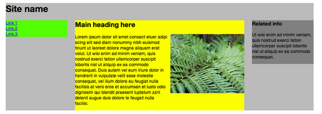
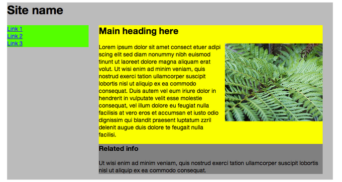
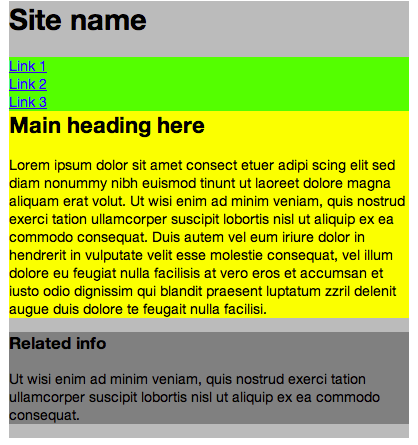
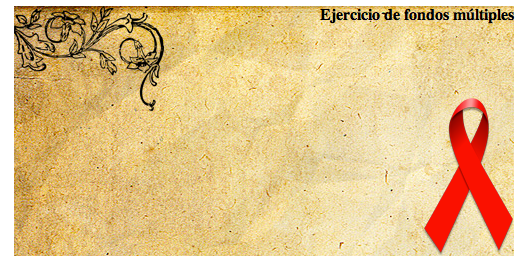


## Ej1. LAYOUT FLUIDO (**2 pts**)

Modificar el fichero CSS:
   - ‘01-layout-fluido/ejercicio/01-layout-fluido.css’
para que la página HTML:
   - ‘01-layout-fluido/ejercicio/01-layout-fluido.html’
se visione de la siguiente forma:
   - La capa azul siempre está a la izquierda de la capa roja.
   - La capa azul tiene que ocupar el 70% mientras que la capa roja el 30%
   - El texto de la capa azul es el doble de grande que el de la capa roja.
   - Que la suma de las dos capas (la azul y la roja) no supera nunca los 1024 píxeles.
	
En la carpeta del ejercicio dispones de 3 imágenes de ejemplo de cómo se debe visualizar la pagina para 3 resoluciones de pantalla distintas (los valores son meramente orientativos)

1. En el fichero *1. Animation.html* aplicar los estilos necesarios al elemento:
`<h1>se va a deslizar</h1>`
para que el texto se desplace en un tiempo de 3 segundos desde el borde derecho de 	la ventana del navegador hacia el borde izquierdo, y viceversa (empleando también 3 	segundos).  Este movimiento se repetirá de forma indefinida.

2. Modifica el código anterior para que el texto deje de mostrarse en pantalla al alcanzar el borde izquierdo y vuelva a aparecer por el derecho (sólo habrá desplazamiento desde la derecha hacia la izquierda)

3. Modifica el código anterior para que el número de iteraciones del movimiento sea 4. Cuál es el estado final de la animación? Y cuál es el estado final si el número de iteraciones es 3?

4. Modifica el código anterior para que al terminar la animación el texto se visualice a la derecha de la ventana del navegador

## Ej2. DESKTOP FIRST (**3 pts**)

Modificar el fichero CSS:
    • ‘04-desktop-first/ejercicio/04-desktop-first.css’
para que la página HTML:
    • ‘04-desktop-first/ejercicio/04-desktop-first.html’
se visione de la siguiente forma:
    • La imagen de fondo de la capa azul va cambiando dependiendo del tamaño del dispositivo. La primera imagen que se carga es la más grande, para los dispositivos más grandes.
    • En dispositivos pequeños el ‘sidebar’ se posiciona debajo ocupando el 100% y en dispositivos medianos y grandes se posiciona a la derecha ocupando el 30%.
    • Breakpoints:
        ◦ Dispositivos medianos: 880px
        ◦ Dispositivos pequeños: 580px
En la carpeta del ejercicio dispones de 3 imágenes de ejemplo de cómo se debe visualizar la pagina para dispositivos grandes, medianos y pequeños.

Dado el  código HTML y CSS del fichero ej02_Transic, crear las transiciones necesarias para pasar del estado inicial al final, aplicando las siguientes transformaciones:
URL VIDEO
1. Al poner el cursor del mouse en la ventana del navegador
   - Desplazar las cajas a la derecha del contenedor
2. Al poner el cursor del mouse en una de las cajas:
   - Cambiar el tamaño de las cajas de 100px a 50px. 
   - Cambiar el color de fondo de azul a rojo. 
   - Cambiar el color del texto de negro a amarillo. 
   - Cambiar el tamaño de letra de 20px a 18px. 
   - Rotar los elementos 270º. 
3. Intercambiar las posiciones de las cajas 1 y 2,
   - Al poner el cursor del mouse sobre caja1 ésta ocupará la posición de caja 2, y viceversa.

Utilizar en cada caso, una duración y función de tiempo diferentes.

## Ej3. MEDIA QUERIES (**1 pt**)

Dados el siguiente código HTML y CSS en el directorio *media queries*, aplicar los Media Query necesarios para obtener el comportamiento mostrado en las imágenes. 

1) Aspecto de la web a pantalla completa:

2) Aspecto de la web en una pantalla de 960px:

3) Aspecto de la web en una pantalla de 480px:

## Ej4. ANIMACIONES Y TRANSICIONES (**3 pts**)

Dados el siguiente código HTML y CSS base, aplicar las animaciones y transformaciones necesarias para conseguir el siguiente efecto:   
URL VIDEO
- Al cargarse la página, únicamente se mostrarán los recuadros con las imágenes, ocultando el título, texto, enlace a "Leer más" y el fondo naranja.
- Al pasar con el ratón sobre la imagen, debe ocurrir lo siguiente:
  - La imagen de fondo aumentará su tamaño, dando la impresión de que se acerca. 
  - Se mostrará el fondo naranja, de manera progresiva. 
  - El título aparecerá por la parte superior de la imagen, hasta colocarse en su lugar. 
  - El párrafo aparecerá por la parte inferior de la imagen, hasta colocarse en su lugar. 
  - Se mostrará el enlace "Leer más", de manera progresiva. 

## Ej5. FONDOS MULTIPLES(**1 pt**)

Dados el código HTML y CSS del directorio fondos, aplicar las reglas CSS necesarias para conseguir el siguiente aspecto:

